# Android CRUD Application

## Overview
This repository contains an Android CRUD (Create, Read, Update, Delete) application designed to manage user data. The application allows users to perform various operations such as adding, viewing, updating, and deleting user information stored in an SQLite database.

## Purpose
The purpose of this project is to showcase proficiency in Android app development by creating a functional CRUD application. The main objectives include:

- Understanding the fundamentals of Android development.
- Implementing database operations using SQLiteOpenHelper.
- Designing user interfaces with XML layouts.
- Integrating user input with database operations.
- Developing a scrollable layout to handle large amounts of data efficiently.

## Features
- **Create**: Add new users with their name, age, height, weight, and marital status.
- **Read**: View the list of all users along with their details.
- **Update**: Modify existing user information.
- **Delete**: Remove users from the database.

## Technologies Used
- Android SDK
- Java
- XML
- SQLite


## Setup Instructions
To set up the project locally, follow these steps:

1. Clone the repository:
    ```bash
    git clone https://github.com/Hetawk/android-crud-application.git
    ```
   2. Open the project in Android Studio.
   3. Build and run the application on an Android device or emulator.

## Usage
- Launch the application to access the CRUD interface.
- Utilize the provided input fields and buttons to perform CRUD operations on user data.
- View the list of users and their details.
- Update or delete existing users as needed.

## NOTE
This project served as an excellent learning opportunity to enhance skills and understanding of Android development. By successfully implementing CRUD functionalities and designing a user-friendly interface, valuable experience in database-driven application development was gained.

# Sample Output

<div style="display: grid; grid-template-columns: repeat(auto-fill, minmax(200px, 1fr)); gap: 10px; justify-content: center;">

<!-- First Row -->
<div style="margin: 5px;">
    
</div>

<div style="margin: 5px;">
    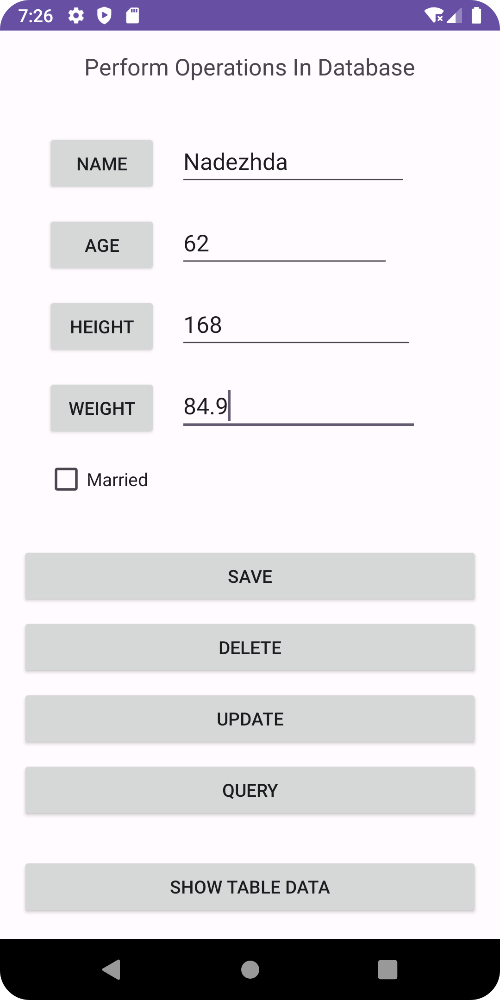
</div>

<div style="margin: 5px;">
    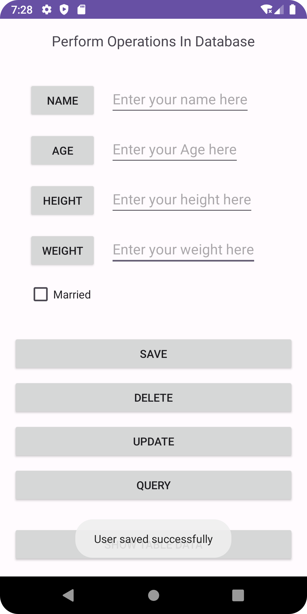
</div>

<!-- Second Row -->
<div style="margin: 5px;">
    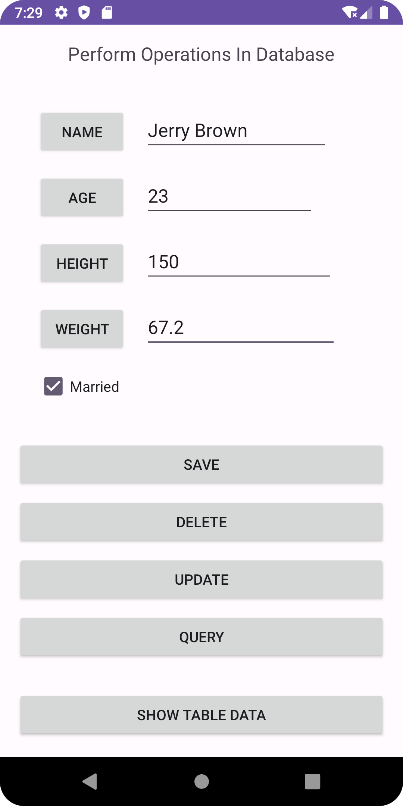
</div>

<div style="margin: 5px;">
    
</div>

<div style="margin: 5px;">
    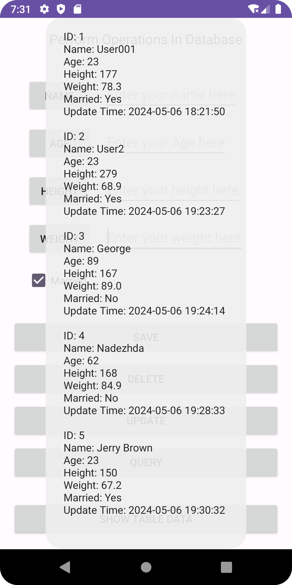
</div>

<!-- Third Row -->
<div style="margin: 5px;">
    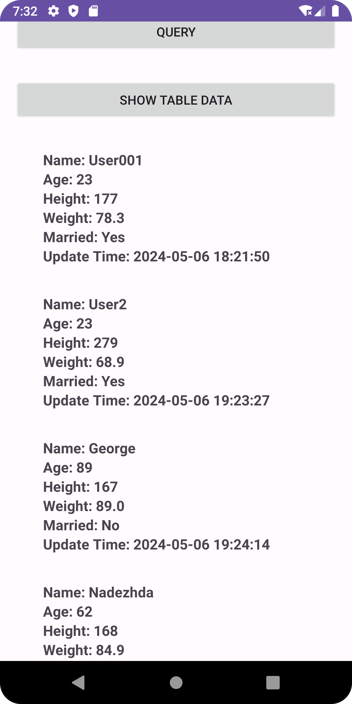
</div>

<div style="margin: 5px;">
    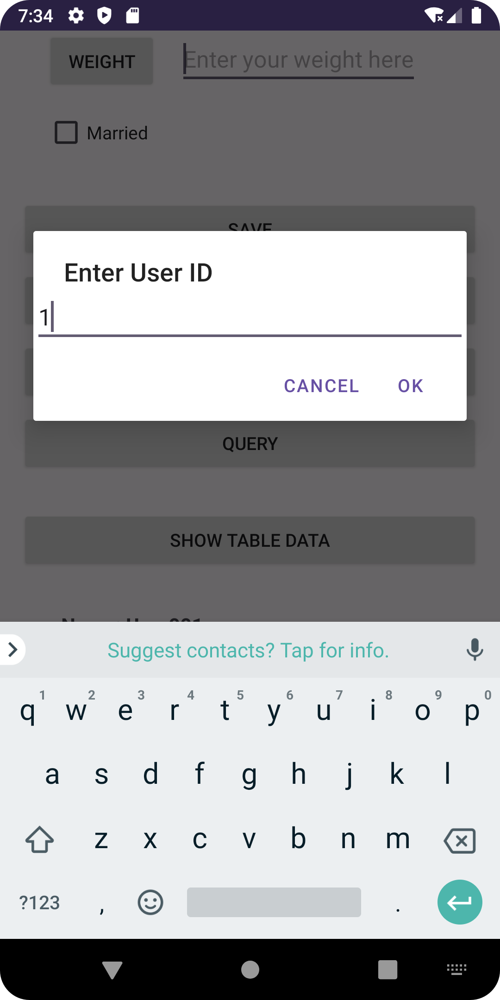
</div>

<div style="margin: 5px;">
    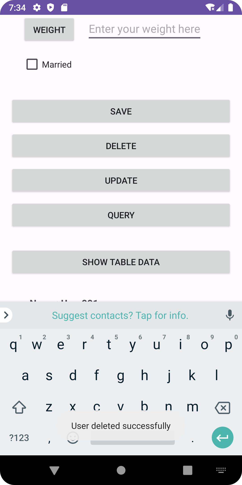
</div>

<!-- Fourth Row -->
<div style="margin: 5px;">
    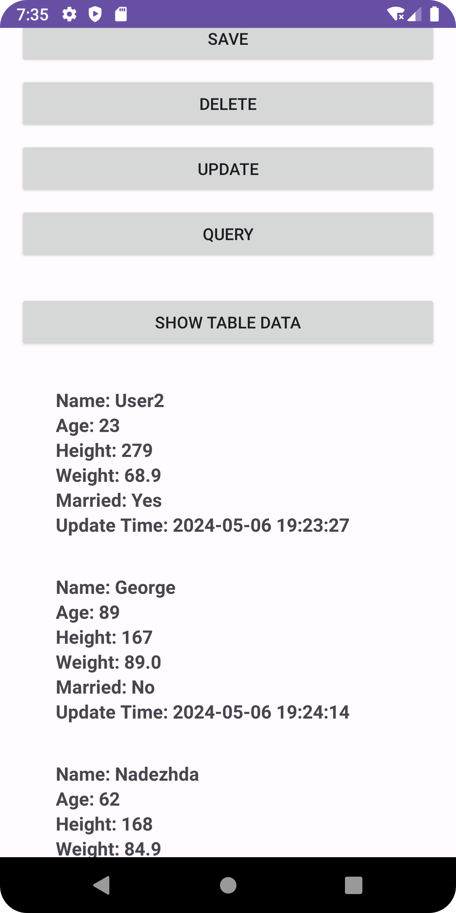
</div>

<div style="margin: 5px;">
    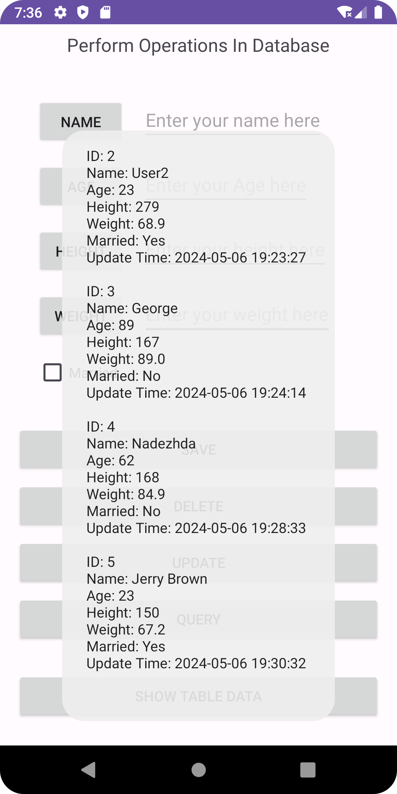
</div>

<div style="margin: 5px;">
    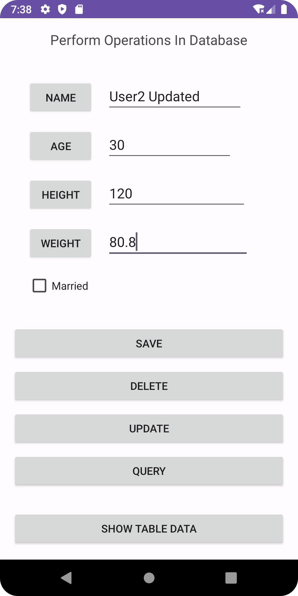
</div>

<!-- Fifth Row -->
<div style="margin: 5px;">
    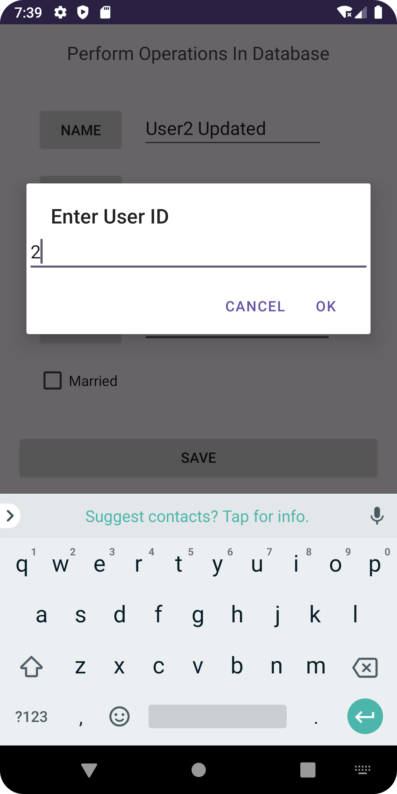
</div>

<div style="margin: 5px;">
    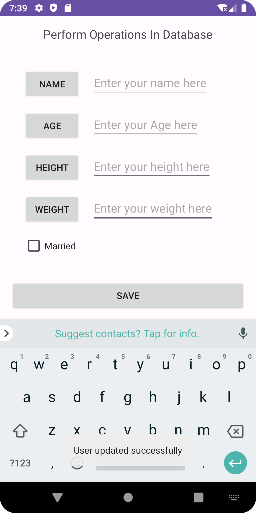
</div>

<div style="margin: 5px;">
    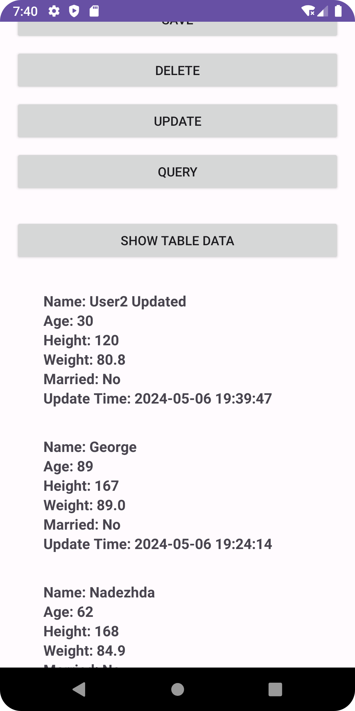
</div>

<!-- Sixth Row -->
<div style="margin: 5px;">
    
</div>

<div style="margin: 5px;">
    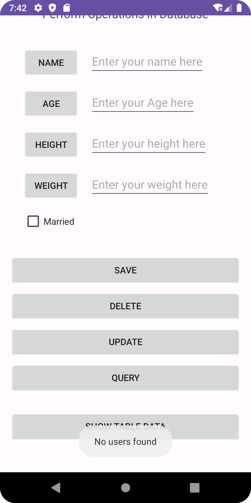
</div>

</div>
